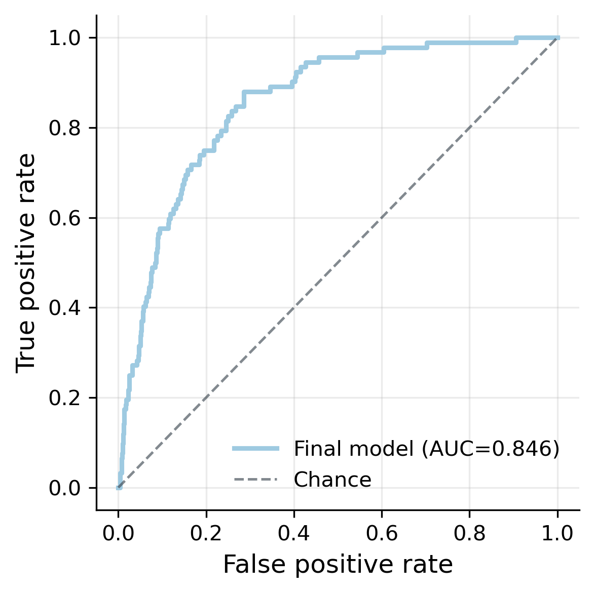
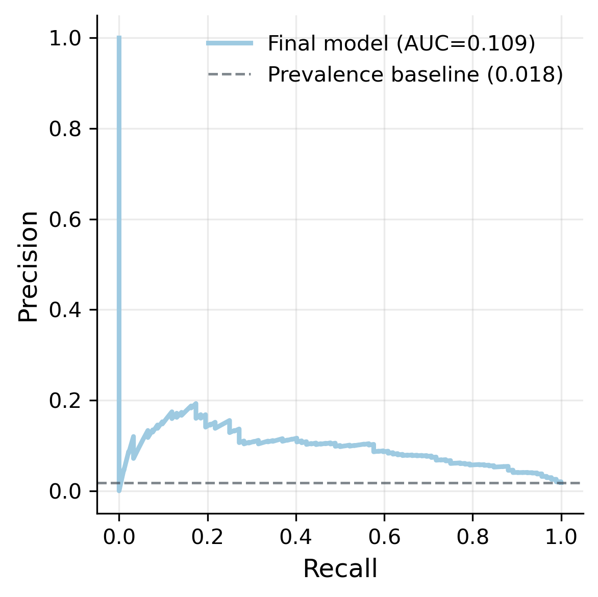
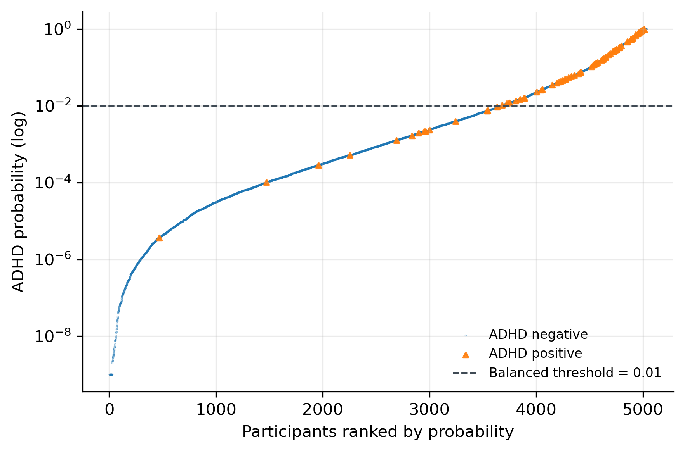
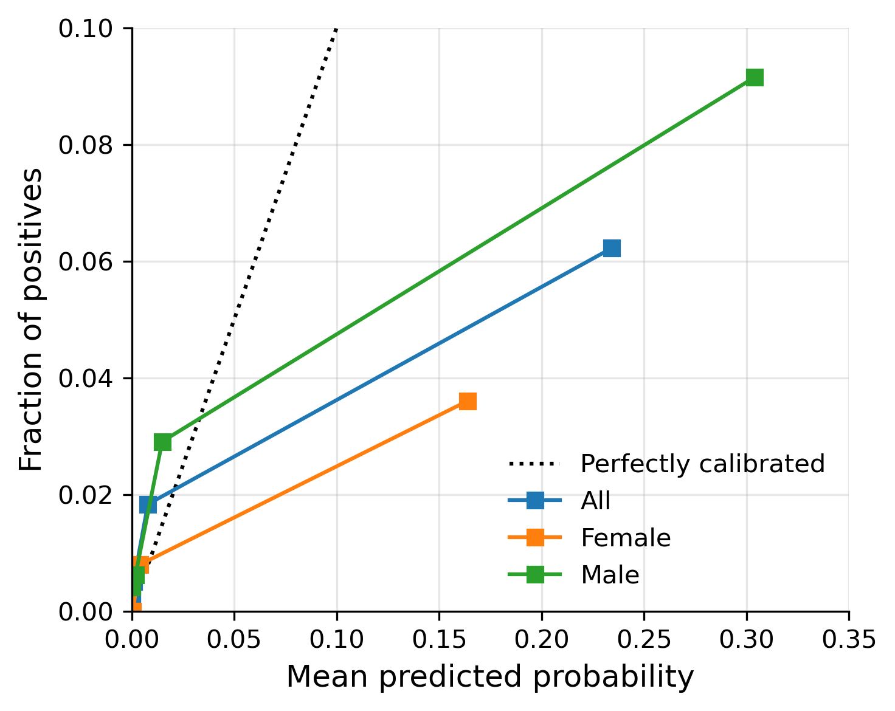
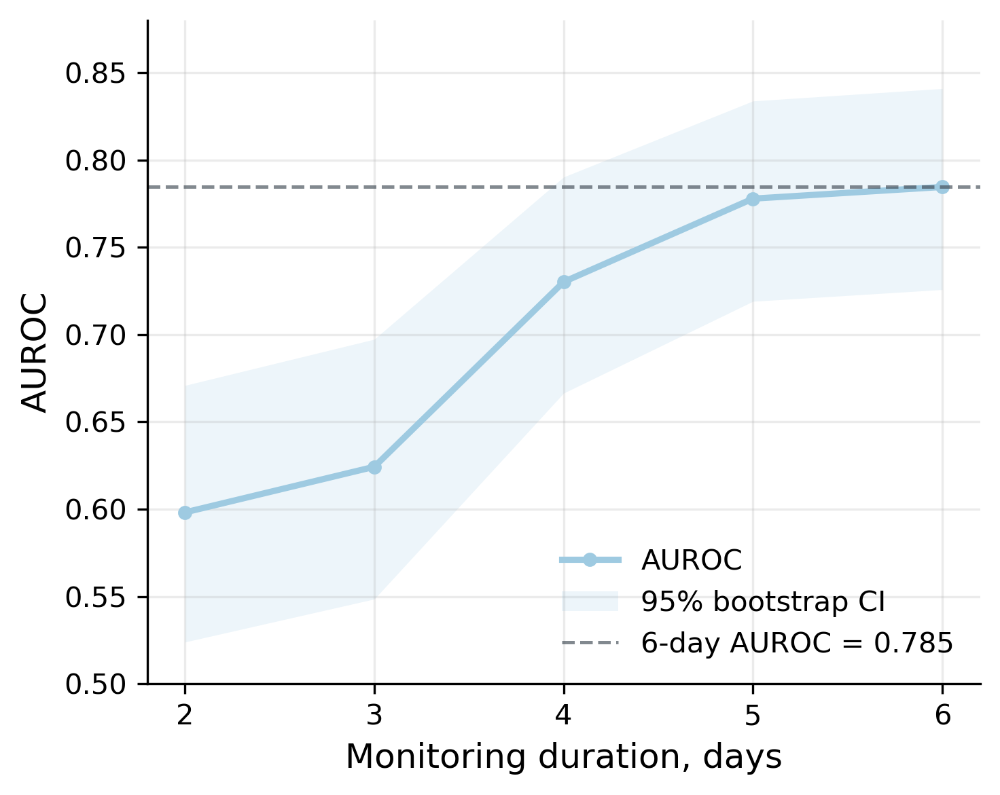

Attention-Deficit Hyperactivity Disorder (ADHD) prediction has the potential to unlock solutions to the UK's under-diagnosis crisis, realising health benefits and social opportunities for those stuck on waiting lists. A gap exists to test whether biomarkers from activity data — intra-daily and weekly temporal factors — can predict ADHD beyond the small convenience samples and opaque modelling approaches currently limiting transition of prediction technologies into clinical practice. This study addresses these limitations with interpretable, fair modelling on large-cohort MCS data, and reports on optimal activity monitoring durations, key for real-world application.

Built against the NHS RAP maturity framework: Baseline, with most of Silver in place. See Code README for full criteria.

::: {.callout-note appearance="simple"}
**MSc Computer Science with Artificial Intelligence**, University of York, 2026. Awarded 80, double-marked.

5,033 children · 171.6 million accelerometer data points · reported to TRIPOD+AI

[Thesis (PDF)](thesis.pdf) · [Code](https://github.com/charles-mcd/predict-adhd)
:::

```{mermaid}
flowchart LR
    A[MCS survey files<br/>4 sweeps] --> C[Labels, covariates,<br/>exclusions]
    B[Raw accelerometer<br/>.dat files] --> D[Non-wear flagging,<br/>day alignment]
    D --> E[tsfresh features<br/>per valid day]
    C --> F[Feature selection]
    E --> F
    F --> G[Model comparison,<br/>tuning]
    G --> H[Evaluation, subgroups,<br/>monitoring duration]
```

The analysis described below is the thesis as submitted, tagged [v1.0.0](https://github.com/charles-mcd/predict-adhd/tree/v1.0.0). [Version 2](#sec-v2) at the end describes subsequent improvements to the pipeline as part of iterative, on-going code review.

## 1. Data extraction

> Secondary data is sourced from the MCS via the UK Data Service. The MCS conducts longitudinal research on 18,827 children born around the millennium, collecting sweeps of observations, questionnaire and interview data every 2-3 years. Natural-setting activity data was collected for 7 days at age-7 with a waist-worn, non-invasive GT1M actigraph.

Survey data came as Stata files, differences between how Stata and pandas handle category naming required parsing:

```{.python filename="extract.py"}
def drop_bad_cats(path, bad_cols):
    """Parse .stata data into pandas.

    Stata allows duplicate categorical labels, pandas throws an error. This
    function drops the offending columns, extracts cat labels and reapplys
    them in pandas.
    """
    with pd.io.stata.StataReader(path) as reader:
        df = reader.read(convert_categoricals=False)
        value_labels = reader.value_labels()

    df = df.drop(columns=bad_cols, errors="ignore")

    for col, labels in value_labels.items():
        if col not in df.columns or col in bad_cols:
            continue

        # skip columns whose labels are not unique
        if len(set(labels.values())) != len(labels.values()):
            continue

        df[col] = pd.Categorical(df[col].map(labels).fillna(df[col]))

    return df
```

**Extraction summary:**

- class labels operationliased from any ADHD diagnosis reported across the four sweeps (ages 5, 7, 11, 14)
- covariates joined from four more files, each with its own ID scheme
- exclusions for confounders: autism, limited fitness, ADHD medication started before activity measurements
- 171.6 million 15-second epochs from raw `.dat` files, processed in chunks on a 40GB machine; tsfresh extraction ran around 15 hours
- the whole pipeline reruns from source with two commands


## 2. Preprocessing algorithms

> The raw timeseries data provides counts every 15 seconds and therefore appropriate for far more granular analysis of within-day features. However, in order to process this data it needed to be mapped to the valid and reliable sample first, this required development of two algorithms. The first applied a non-wear marker to each participant's timeseries data, based on the same rules used by MCS to remain consistent. The second determined how many days offset the timeseries were from the first recorded valid day.

Non-wear is defined as 80 or more consecutive zero-count epochs. Finding every such run across millions of rows would be costly using loops, a vectorised algorithm was desinged instead:

```{.python filename="timeseries.py"}
# flag for non-wear time: >=80 consecutive 0s
s = df.iloc[:, 0].eq(0)                              # boolean for zero count
groups = s.ne(s.shift()).cumsum()                    # groups for consec. true/false runs
run_lengths = s.groupby(groups).transform('size')    # broadcast run length back to rows
df["NW_flag"] = (s & (run_lengths >= NON_WEAR_RUN))  # flag rows 80+ zero-run
```

**Preprocessing summary:**

- tabular data - survey responses and activity aggregates used to engineer handcrafted features - were cleaned, merged and processed into a valid sample based on inclusion and exclusion criteria
- the offset algorithm aligns the timeseries data to the valid sample by sliding a day-length window along the recording until window wear-time statistics match the MCS record for the first valid day
- where it could not match (0.2% of recordings), the participant was dropped. The effect of excluded data were analysed for sample bias by monitoring changes to class and covariate distributions

## 3. Feature selection

> The large generic output of tsfresh is then subjected to a series of feature reduction methods to mitigate known problems for high-dimensional datasets. Features are then selected for consistently ranking well across a range of methods based on mutual information, f-scoring, regularised logistic regressors and extra trees. This range prevents any particular method dominating and applies broad assessment of feature importance.

```{.python filename="selection.py"}
# feature consensus across selection methods
selected_sets = {
    name: set(vals)
    for name, vals in selected_features.items()
}

all_selected = sorted(set().union(*selected_sets.values()))

selection_matrix = pd.DataFrame({
    name: [feature in selected_sets[name] for feature in all_selected]
    for name in selected_sets
}, index=all_selected)

selection_matrix["n_methods"] = selection_matrix.sum(axis=1)
```

> The most selected features by far are frequency and spectral-based such as Fourier derivations which reflect periods, oscillations and rhythms. Interestingly, the least prominent selected include the simpler sum/magnitude features most closely related to the handcrafted features.

| Feature family | Selected | Share of model weight |
|---|---:|---:|
| Frequency / spectral structure | 354 | 83.8% |
| Change, variability, sequence | 28 | 4.6% |
| Distribution, extremes, bursts | 15 | 3.9% |
| Timing, trend, energy location | 19 | 3.8% |
| Temporal dependence, stationarity | 13 | 2.4% |
| Complexity / entropy | 5 | 0.6% |
| Simple activity volume / magnitude | 7 | 0.4% |


**Feature selection summary:**

- 1,554 candidate features to 442, keeping only those at least two methods agreed on
- selection matrix doubles as an audit trail: which method kept what
- interpretability: grouping 442 coefficients into families provides relevant clinical insights
- weekday and weekend features are selected with equal importance (222 and 220), evidencing RQ2

## 4. Evaluation

::: {layout-ncol=2}



:::


> Logistic Regression consistently outperformed Naïve Bayes and Extra Trees in all conditions with the selected tsfresh-stratified features and across all metrics. Final scoring achieved AUROC 0.846 and AUPRC 5.9x baseline. Note the low precision scores reflecting high false positives, information that is absent from ROC analysis alone.

{width=90%}

**Evaluation summary:**

- AUROC alone provides a threshold-agnostic score of how well the model ranks class, secondary metrics include AUPRC able to account for low class prevalence (1.8%) by revealing low precision scores
- threshold analysis reveals the sensitivity/specificity trade-off:
    - the screening case: optimise for **sensitivity**, maximise true positives e.g. to send families on waiting lists information and support, where a false positive costs little
    - the diagnostic case: optmise for **specificity**, minimise false positives e.g. to diagnose and start treatment, where a false positive is costly

## 5. Subgroups and calibration

> Algorithmic bias defines systematic errors due to biases in data, labels or modelling; even interpretable approaches are susceptible where healthy performance metrics on the whole dataset may belie performance discriminations between subgroups, potentially compounding existing inequalities.

{width=60%}

<!-- FIGURE: subgroup_calibration.png -->

| Group | Prevalence | AUROC | Brier | Calibration slope |
|---|---:|---:|---:|---:|
| All | 1.8% | 0.834 | 0.035 | 0.299 |
| Female | 0.9% | 0.881 | 0.023 | 0.319 |
| Male | 2.7% | 0.799 | 0.049 | 0.275 |


> The analysis reveals broadly comparable subgroup performance, with imbalance seen in higher female ranking metrics but also unstable due to prevalence. The model's probabilities are substantially under-scaled and thus do not represent actual risk.

**Subgroup summary:**

- ethnicity could not be analysed:  10 > non-white positive cases, despite MCS oversampling
- the model ranks well, however this analysis reveals miscalibrated probabilities at the individual level, prompting recalibration methods as future work
- analysing subgroups responds to the TRIPOD+AI framework for transparent and fair data processing and reporting

## 6. Significance tests guiding recommendations

> To compare monitoring period durations, participants with at least six valid days monitoring were selected. Differences in AUROC and AUPRC between each reduced duration and the 6-day reference condition were assessed using paired bootstrap resampling, appropriate for non-independent samples.

```{.python filename="evaluate.py"}
# paired bootstrap
boot_rows = []
rng = np.random.default_rng(42)
duration_cols = {2: "probs_2", 3: "probs_3", 4: "probs_4", 5: "probs_5", 6: "probs_6"}

for _ in range(n_boot):
    sample = preds.iloc[rng.integers(0, len(preds), len(preds))]

    if sample["y"].nunique() < 2:
        continue

    for days, col in duration_cols.items():
        boot_rows.append({"days": days, **metrics(sample, col)})
```

{width=70%}


> Performance improved monotonically across AUROC, AUPRC and Spearman metrics as duration increased. 2- and 3-day durations were both substantially lower than the 6-day reference, found to be significant with p-values < 0.001. 5 days produced near-equivalent performance and was found to not be significantly different.

**Conclusions:**

- Holm adjusted p-values on bootstrap resampling show significantly worse prediction power for 2 and 3 day monitoring durations, recommending at least 5 days of activity monitoring for reliable AUROC
- using these techniques, observed patient data produced real-world recommendations for monitoring periods and data collection protocols, with implications for planning costs and minimising wear-time for children who may have sensitivities/wear-compliance issues
- In addition, further research into ADHD actigraphy can realise weekday/weekend and intra-daily differences found to be important in differentiating the condition, and apply fair and interpretable methods to acheive this

## Version 2: iterative improvement  {#sec-v2}

<!-- Link targets: tag v2.0.0 and the compare view between the tags. -->

After submission I reviewed the pipeline and made changes below, released as [v2.0.0](https://github.com/charles-mcd/predict-adhd/tree/v2.0.0). The full difference is readable [side by side](https://github.com/charles-mcd/predict-adhd/compare/v1.0.0...v2.0.0).

**Consensus selection within cross-validation folds**

```{.python filename="selection.py"}
class ConsensusSelector(SelectorMixin, BaseEstimator):
    """Second pass consensus as a transformer, fitted on training folds only."""

    def __init__(self, selectors, n_consensus=N_CONSENSUS):
        self.selectors = selectors
        self.n_consensus = n_consensus

    def fit(self, X, y):
        votes = np.zeros(X.shape[1], dtype=int)

        for selector in self.selectors.values():
            votes += clone(selector).fit(X, y).get_support().astype(int)

        self.votes_ = votes
        self.support_ = votes >= self.n_consensus
        self.n_features_in_ = X.shape[1]
        return self

    def _get_support_mask(self):
        return self.support_
```


**Updates:**

- **consensus feature selection** now runs inside each training fold, wrapped in a scikit-learn transformer, reducing the potential for leakage from held-out data and following the method already implemented for small-set selection
- **subgroup bootstrapping** gives an interval for AUROC scoring, improving precision by measuring stability given the low prevalence rate, compounded by splitting unbalanced subgroups, i.e. only 22 positive class females
- **subgroup testing** now uses corrected resampled t-test (Nadeau & Bengio, 2003) to account for non-independence between cross-validation folds and repeats
- **calibration intercept** fitted with the slope held at 1 (Van Calster et al., 2019), and the subgroup audit run on the final model's own predictions

<!-- v2.1.0: pytest section once the tests are added. -->
